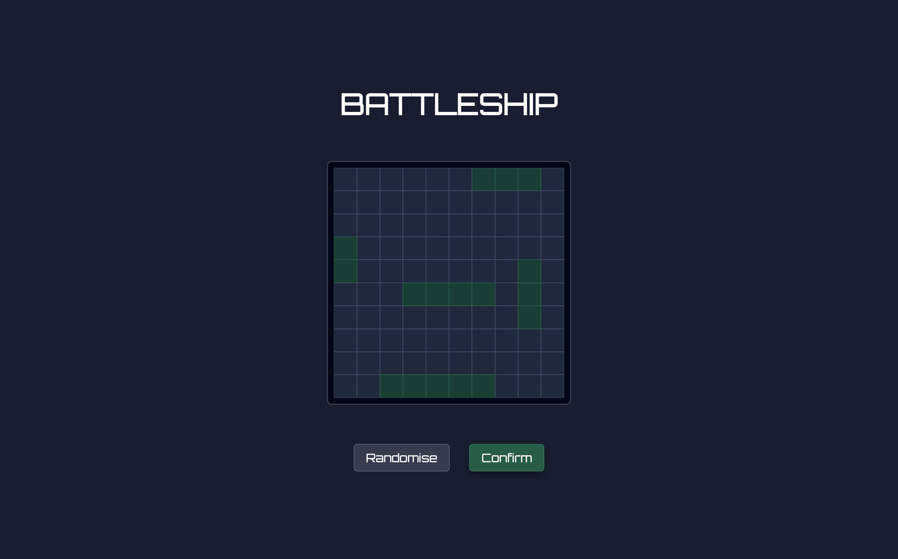
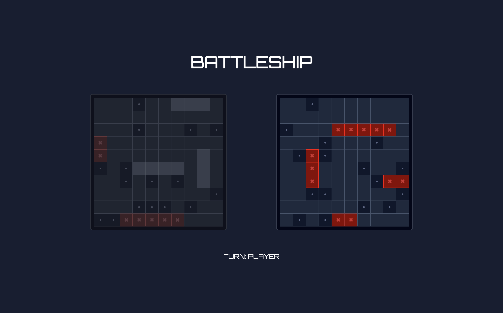

# Battleship

A browser-based Battleship game built with JavaScript and TDD.

🔗 [Live Demo](https://battleship-three-eta.vercel.app/)

## Screenshots

### Ship Placement

### Gameplay

## Features

- Play against the computer with smart attack logic
- Random ship placement
- Turn-based gameplay with visual feedback
- Hit, miss and sunk states rendered on the board

## Built with

- HTML 
- CSS
- JavaScript
- Jest (TDD)
- Webpack
- Babel